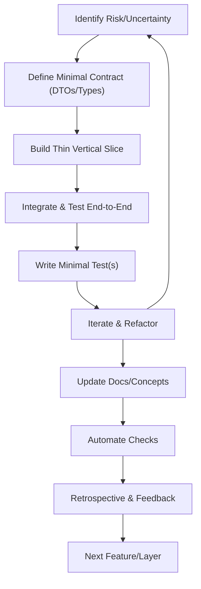

🚨 **CRITICAL WARNING: WORKFLOW FRAGMENTATION DETECTED** 🚨

> **STATUS:** This workflow implements **task fragmentation** ("thin slices") that contradicts canonical comprehensive generation principles.
> 
> **DO NOT USE** fragmented development approaches for IDGL implementations. This defeats comprehensive solution generation.
> 
> **CANONICAL AUTHORITY:** Use only [Intent Atlas Canonical Concept Foundation](./intent-atlas/concept/) for development workflow approaches.
> 
> **AUDIT REFERENCE:** See [INCONSISTENCY_AUDIT_REPORT.md](./intent-atlas/INCONSISTENCY_AUDIT_REPORT.md) for workflow contradiction analysis.

---

# Solo Fullstack Developer Workflow (with AI Assistant)

---

## How This Fits

This workflow is part of the `/00-meta` standards system. It is designed for solo developers but is fully compatible with collaborative and AI-assisted workflows. For session rituals, progress tracking, and status marking, see [session-checklist.md](./session-checklist.md) and [assistant-session-rules.md](./assistant-session-rules.md). All terminology and process steps are aligned with the conventions and rules in this folder.

---

## References
- [session-checklist.md](./session-checklist.md)
- [assistant-session-rules.md](./assistant-session-rules.md)
- [epic-conventions.md](./epic-conventions.md)
- [user-story-conventions.md](./user-story-conventions.md)
- [PROJECT-STATUS.md](./PROJECT-STATUS.md)

---

---

## 1. Context & Philosophy
- As a solo developer, you control the entire stack and product direction.
- You can switch between frontend and backend as needed, and evolve contracts, data models, and UI flows on the fly.
- Feedback loops are internal and instant, so you can prioritize what's most uncertain, risky, or valuable at any moment.
- The goal is to maximize learning, minimize wasted work, and deliver value quickly.
- **For collaborative or AI-assisted work, follow the same workflow, but ensure all session rituals, progress tracking, and status updates are performed as described in the referenced meta-docs.**

---

## 2. Recommended Workflow

### A. Start with the Most Uncertain or Risky Part
- If UI/UX is unclear, prototype frontend first (with mock data if needed).
- If business logic or data model is complex, start with backend modeling and API design.
- If both are clear, start with a minimal vertical slice (one feature, end-to-end).

### B. Use Contract-First, But Stay Flexible
- Define minimal DTOs/types/interfaces for each feature, but let them evolve as you build.
- Use TypeScript types or OpenAPI as your "contract"—change them as you learn.

### C. Build in Thin, Testable Slices
- For each feature, build just enough backend (model, endpoint, mock logic) and just enough frontend (UI, state, API call) to see it work end-to-end.
- Alternate between backend and frontend as needed to keep integration tight.

### D. Use Mocks and Stubs Where Needed
- Use mock data or MSW for frontend if backend isn't ready.
- Use simple API clients or Postman for backend if frontend isn't ready.

### E. Integrate Testing, Documentation, and Automation via Meta-Docs
- For each slice, write at least one test (unit, integration, or E2E) to validate the core logic or flow.
- Update or create relevant concept docs, API docs, and README snippets for each feature/slice.
- Use scripts/tools for linting, formatting, type-checking, and running tests on save/commit.
- **For detailed standards and rituals, see [session-checklist.md](./session-checklist.md), [epic-conventions.md](./epic-conventions.md), and [user-story-conventions.md](./user-story-conventions.md).**

### F. Iterate Rapidly, Refactor Often
- Refactor types, endpoints, and UI as you learn—no blockers, no handoffs.
- Use your AI assistant to generate boilerplate, refactor code, or check for consistency.

### G. Feedback & Retrospective
- After each major slice or feature, take 5 minutes to jot down what worked, what didn't, and what to improve next time.
- **Log all progress and session notes in the canonical progress file as described in [session-checklist.md](./session-checklist.md).**

---

## 3. AI Assistant Usage Patterns
- Generate DTOs, types, or OpenAPI specs.
- Refactor functions, suggest edge cases, or draft README/concept doc sections.
- Generate or review test cases for new features.
- Brainstorm edge cases or validation logic.
- Review code for consistency, best practices, and documentation hygiene.

---

## 4. Pitfalls & Anti-Patterns
- Don't over-engineer or prematurely optimize—build just enough for the next slice.
- Don't let DTOs/types drift from real data—sync them after every backend or frontend change.
- Don't skip tests or documentation—use your AI assistant to help keep them up to date.
- Don't forget to commit early and often, and tag major milestones.
- **Don't forget to update all status markers and progress files as described in [session-checklist.md](./session-checklist.md).**

---

## 5. Summary Table: Enhanced Steps

| Step                | What to Do                                                      | Best Practice/Tooling Tip                |
|---------------------|-----------------------------------------------------------------|------------------------------------------|
| 1. Identify Risk    | What's most uncertain—UI, data, logic? Start there.             | Use AI to brainstorm edge cases.         |
| 2. Define Contract  | Write minimal DTOs/types/interfaces for the feature.            | Use TypeScript/OpenAPI, keep in sync.    |
| 3. Build Thin Slice | Implement just enough backend & frontend to see it work.        | Use mocks/stubs, test as you go.         |
| 4. Integrate Early  | Test end-to-end ASAP, even with mocks or stubs.                 | Write at least one test per slice.       |
| 5. Iterate          | Refactor types, endpoints, and UI as you learn.                 | Use AI for refactoring/documentation.    |
| 6. Document         | Update concept docs, API docs, and README as you go.            | Use AI to draft/maintain docs.           |
| 7. Automate         | Lint, format, type-check, and test on save/commit.              | Use Husky, ESLint, Prettier, Vitest.     |
| 8. Feedback         | Retrospective after each slice—what to improve next?            | Log in progress file per session ritual. |
| 9. Repeat           | Move to next feature or layer as needed.                        | Commit/push often, tag milestones.       |

---

## 6. Why This Works
- **No wasted work:** Only build what you need, when you need it.
- **Maximum learning:** Get feedback from every layer, every day.
- **Ultimate flexibility:** Change direction instantly, with no handoffs or blockers.
- **AI-accelerated:** Use your AI assistant to automate, check, and document as you go.

---

**Pro Tip:** Use your AI assistant to generate test cases and edge scenarios for every new contract or endpoint!

**Pitfall:** Don't let your DTOs/types drift from the real data—sync them after every backend or frontend change.

**See Also:** [session-checklist.md](./session-checklist.md) | [PROJECT-STATUS.md](./PROJECT-STATUS.md) | [epic-conventions.md](./epic-conventions.md) | [user-story-conventions.md](./user-story-conventions.md)

**Use this workflow as your regular reference for solo or collaborative fullstack product development.** 