# NestJS Backend Process: The Configuration

> **Type:** Configuration-Driven System Specification  
> **Category:** Platform-Systematization Input  
> **Platform:** NestJS  
> **Related:** [nestjs-complete-process.md](./nestjs-complete-process.md)  

---

## The Single Source of Truth

This document defines **THE CONFIGURATION** - the single comprehensive specification that drives the entire NestJS backend generation process. Instead of managing 91 atomic instruction files, we use **one configuration** that systematically generates a complete, working backend.

### **Configuration → Complete Working Backend**

```mermaid
graph LR
    A[📋 Single Configuration] --> B[🔧 Tool-Leveraged Generation]
    B --> C[✅ Working NestJS Backend]
    
    A --> A1[Entities & Fields]
    A --> A2[Modules & Endpoints]  
    A --> A3[Authentication & Security]
    A --> A4[Database & Environment]
    
    C --> C1[✅ Runs Immediately]
    C --> C2[✅ All CRUD Works]
    C --> C3[✅ Auth Protected]
    C --> C4[✅ Database Connected]
```


**Anti-Pattern Avoided**: ListNest had 186 fragmented files with status "AWAITING INTENT". This configuration approach generates working software immediately.

---

## Complete Input Configuration Interface

```typescript
interface NestJSBackendConfig {
  // Project Metadata
  project: {
    name: string;                    // "e-commerce-api"
    description: string;             // "E-commerce backend API"
    version: string;                // "1.0.0"
    author: string;                 // "Development Team"
    packageManager: 'npm' | 'yarn' | 'pnpm'; // "npm"
  };

  // Database Configuration
  database: {
    type: 'postgres' | 'mysql' | 'sqlite' | 'mongodb';
    host?: string;                  // "localhost"
    port?: number;                  // 5432
    name: string;                   // "ecommerce_db"
    username?: string;              // "postgres"
    password?: string;              // "password"
    synchronize?: boolean;          // true for development
  };

  // Authentication Configuration
  authentication: {
    enabled: boolean;               // true
    strategy: 'jwt' | 'passport' | 'both'; // "jwt"
    jwtSecret?: string;             // "your-secret-key"
    jwtExpiration?: string;         // "1h"
    passwordHashing: boolean;       // true
    guards: string[];               // ["jwt", "local"]
  };

  // API Documentation
  documentation: {
    swagger: boolean;               // true
    title: string;                  // "E-commerce API"
    description: string;            // "Complete e-commerce backend"
    version: string;                // "1.0"
    path: string;                   // "api"
  };

  // Entities Definition
  entities: Array<{
    name: string;                   // "User"
    tableName?: string;             // "users"
    fields: Array<{
      name: string;                 // "username"
      type: 'string' | 'number' | 'boolean' | 'date' | 'decimal' | 'text' | 'enum';
      required: boolean;            // true
      unique?: boolean;             // true
      nullable?: boolean;           // false
      length?: number;              // 50
      precision?: number;           // For decimal: 10
      scale?: number;               // For decimal: 2
      default?: any;                // Default value
      enum?: string[];              // For enum type
      validation?: {
        min?: number;               // Minimum value/length
        max?: number;               // Maximum value/length
        pattern?: string;           // Regex pattern
        email?: boolean;            // Email validation
        url?: boolean;              // URL validation
        custom?: string[];          // Custom validators
      };
    }>;
    relationships?: Array<{
      type: 'oneToOne' | 'oneToMany' | 'manyToOne' | 'manyToMany';
      target: string;               // "Order"
      mappedBy?: string;            // "user"
      joinColumn?: string;          // "userId"
      cascade?: boolean;            // true
      eager?: boolean;              // false
    }>;
    timestamps?: boolean;           // true (adds createdAt, updatedAt)
    softDelete?: boolean;           // false
  }>;

  // Modules Definition
  modules: Array<{
    name: string;                   // "users"
    type: 'resource' | 'service' | 'auth' | 'custom';
    entity?: string;                // "User" (for resource modules)
    authentication?: {
      required: boolean;            // true
      roles?: string[];             // ["admin", "user"]
      guards?: string[];            // ["jwt", "roles"]
    };
    endpoints?: Array<{
      method: 'GET' | 'POST' | 'PUT' | 'PATCH' | 'DELETE';
      path: string;                 // ":id/orders"
      operationId: string;          // "getUserOrders"
      summary: string;              // "Get user orders"
      authenticated: boolean;       // true
      roles?: string[];             // ["user"]
      responses?: Array<{
        status: number;             // 200
        description: string;        // "Orders retrieved successfully"
        schema?: string;            // "Order[]"
      }>;
    }>;
    services?: Array<{
      name: string;                 // "EmailService"
      type: 'internal' | 'external'; // "external"
      methods?: string[];           // ["sendWelcomeEmail", "sendResetEmail"]
    }>;
  }>;

  // Additional Features
  features: {
    globalFilters: boolean;         // true (exception handling)
    globalPipes: boolean;           // true (validation)
    globalInterceptors?: string[];  // ["logging", "timeout"]
    cors: boolean;                  // true
    rateLimit?: {
      enabled: boolean;             // true
      windowMs: number;             // 900000 (15 minutes)
      max: number;                  // 100 requests
    };
    logging: {
      enabled: boolean;             // true
      level: 'error' | 'warn' | 'info' | 'debug'; // "info"
    };
    testing: {
      unit: boolean;                // true
      e2e: boolean;                 // true
      coverage: boolean;            // true
    };
    docker: boolean;                // false
    migration: boolean;             // true
    seeding: boolean;               // true
  };

  // Environment Configuration
  environment: {
    variables: Array<{
      name: string;                 // "JWT_SECRET"
      type: 'string' | 'number' | 'boolean';
      required: boolean;            // true
      default?: any;                // Default value
      description: string;          // "JWT signing secret"
    }>;
  };
}
```

---

## Configuration Sections Explained

### **Project Metadata**
Basic project information used for package.json generation and documentation:
- `name`: Project identifier (kebab-case recommended)
- `description`: Brief project description for documentation
- `version`: Semantic version (e.g., "1.0.0")
- `author`: Project author/team information
- `packageManager`: Preferred package manager for dependencies

### **Database Configuration**
Database connection and TypeORM setup:
- `type`: Database type (affects generated entities and imports)
- Connection details (`host`, `port`, `username`, `password`)
- `synchronize`: Auto-sync schema (true for development, false for production)

### **Authentication Configuration**
Security and authentication setup:
- `enabled`: Whether to generate auth module
- `strategy`: Authentication method (JWT, Passport, or both)
- `guards`: Security guards to generate and apply
- `passwordHashing`: Enable bcrypt password hashing

### **Entities Definition**
Core data model specification:
- **Fields**: Complete field definition with types, validation, and constraints
- **Relationships**: Entity relationships with proper TypeORM decorators
- **Timestamps**: Automatic createdAt/updatedAt fields
- **Soft Delete**: Mark records as deleted instead of removing

### **Modules Definition**
Application module structure:
- **Type**: Resource (CRUD), service, auth, or custom modules
- **Authentication**: Per-module auth requirements and role-based access
- **Custom Endpoints**: Additional endpoints beyond standard CRUD
- **Services**: External service integrations

### **Features Configuration**
Additional application features:
- **Global Components**: Filters, pipes, interceptors
- **Security**: CORS, rate limiting
- **Logging**: Application logging configuration
- **Testing**: Test setup and coverage
- **DevOps**: Docker, migrations, seeding

### **Environment Variables**
Runtime configuration:
- Variable definitions with types and descriptions
- Required vs. optional variables
- Default values for development

---

## Parameter Validation Rules

### **Entity Field Types**
- `string`: VARCHAR with optional length
- `number`: INTEGER or FLOAT 
- `decimal`: DECIMAL with precision/scale
- `boolean`: BOOLEAN type
- `date`: DATE/DATETIME type
- `text`: TEXT type for long content
- `enum`: ENUM type with predefined values

### **Relationship Types**
- `oneToOne`: 1:1 relationship with unique foreign key
- `oneToMany`: 1:N relationship (parent side)
- `manyToOne`: N:1 relationship (child side)
- `manyToMany`: N:N relationship with junction table

### **Validation Types**
- `min`/`max`: Numeric or string length constraints
- `email`: Email format validation
- `url`: URL format validation
- `pattern`: Custom regex validation
- `custom`: Custom validator names

---

## Usage Examples

See [Complete Examples](./examples/complete-examples.md) for real-world configuration examples including:
- E-commerce backend with complex relationships
- Blog platform with user management
- Task management system with teams
- Simple CRUD application

---

**Related Documents:**
- [Complete Process Overview](./nestjs-complete-process.md)
- [Phase 1: Scaffolding](./phases/phase-1-scaffolding.md)
- [Complete Examples](./examples/complete-examples.md) 