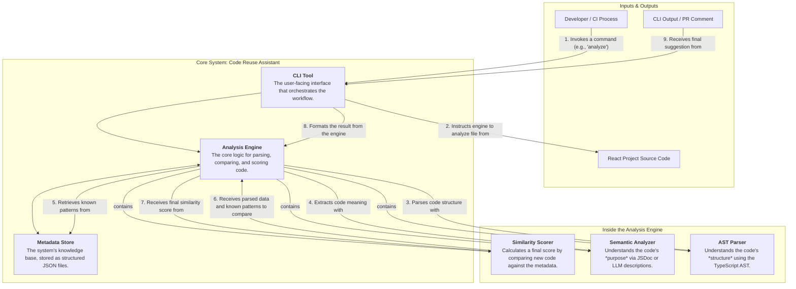

### System Architecture Diagram

This diagram illustrates the high-level components of the Code Reuse Assistant and how they interact during an analysis workflow.

### Component Definitions

Here is a detailed breakdown of each component's responsibilities:

1.  **CLI Tool**
    *   **Description:** This is the primary entry point for any user or automated process. It is responsible for parsing command-line arguments, invoking the correct internal modules, and formatting the final output for the user.
    *   **Responsibilities:**
        *   Define and manage commands (e.g., `generate-metadata`, `analyze`).
        *   Orchestrate the high-level workflow by calling the Analysis Engine.
        *   Present results, suggestions, or errors in a clear, human-readable format to the console or as a PR comment.
    *   **Technology:** `commander.js` running on Node.js.

2.  **Metadata Store**
    *   **Description:** The "brain" of the assistant. It is a persistent, queryable database of all known code patterns within the target React project. To keep it simple and performant, it will be implemented as a set of structured JSON files.
    *   **Responsibilities:**
        *   Store structured data for components, hooks, and utilities.
        *   Provide an easily accessible source of truth for the Analysis Engine.
        *   Be updated by the `generate-metadata` command and read by the `analyze` command.
    *   **Technology:** A collection of `.json` files within a dedicated `metadata/` directory.

3.  **Analysis Engine**
    *   **Description:** The heart of the system. This component contains the core logic for turning raw source code into actionable suggestions. It is an internal orchestrator that uses its sub-components (Parser, Analyzer, Scorer) to perform its function.
    *   **Responsibilities:**
        *   Take a file path as input.
        *   Coordinate the parsing, semantic analysis, and similarity scoring processes.
        *   Return a structured result (e.g., a list of suggestions with similarity scores) to the CLI Tool.

4.  **AST Parser (Sub-component of Analysis Engine)**
    *   **Description:** A highly precise structural parser. It deconstructs TypeScript/TSX source code into an Abstract Syntax Tree (AST), which is a hierarchical representation of the code's structure.
    *   **Responsibilities:**
        *   Traverse the AST to identify key declarations (React components, hooks, functions).
        *   Extract detailed structural information: names, prop/argument lists with types, return types.
        *   Convert this raw structural data into the standardized format required by the Metadata Store.
    *   **Technology:** `ts-morph` library.

5.  **Semantic Analyzer (Sub-component of Analysis Engine)**
    *   **Description:** This component's goal is to understand the *intent* or *purpose* of a piece of code, going beyond its raw structure.
    *   **Responsibilities:**
        *   Extract JSDoc comments associated with a component or function to use as a primary semantic description.
        *   (Future Enhancement) If JSDoc is missing, generate a concise, one-sentence description of the code's purpose using an LLM.
    *   **Technology:** String manipulation for JSDoc; potentially an API call to a service like OpenAI for LLM-based analysis.

6.  **Similarity Scorer (Sub-component of Analysis Engine)**
    *   **Description:** The final decision-maker. It compares a newly parsed piece of code against every relevant entry in the Metadata Store.
    *   **Responsibilities:**
        *   Calculate a **structural similarity score** by comparing AST-derived data (e.g., "how many props have the same name and type?").
        *   Calculate a **semantic similarity score** by comparing the description strings (e.g., using a library like `string-similarity`).
        *   Combine these into a single, weighted score.
        *   Return the top match(es) that exceed a configurable similarity threshold.
