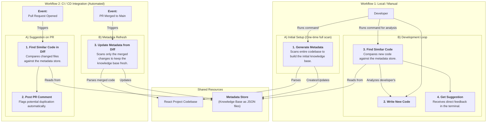

### Simplified Workflow Diagram

This diagram shows two parallel workflows: a manual one for local development and an automated one for CI/CD integration. Both rely on the same core logic but are triggered differently.

### Workflow Description

This more focused diagram clearly distinguishes between:

1.  **Local Workflow:**
    *   **Initial Scan:** A developer manually runs a command to perform a one-time, full scan of the project to create the initial `Metadata Store`.
    *   **Development Loop:** As they write code, they can manually trigger an analysis on their new file. The tool compares this new "comparable part" against the `Metadata Store` and provides immediate suggestions.

2.  **CI Workflow:**
    *   **PR Analysis:** When a pull request is created, an automated job runs. It analyzes only the changed files (`git diff`) against the existing `Metadata Store` and posts a comment if it finds high similarity.
    *   **Metadata Refresh:** When a pull request is merged, another automated job is triggered. It scans the merged changes and updates the `Metadata Store`, ensuring the knowledge base is always synchronized with the main branch without needing a full re-scan every time. 