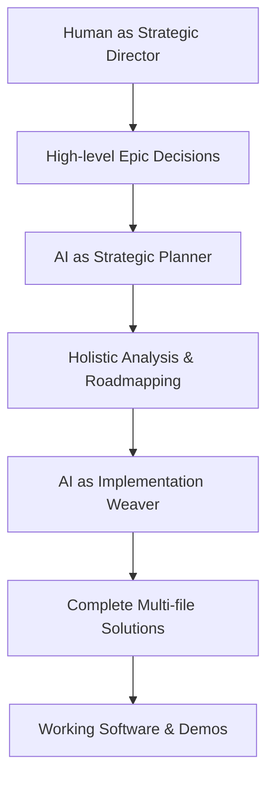
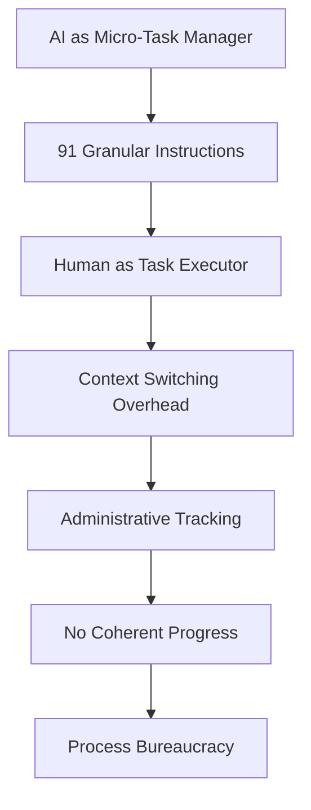
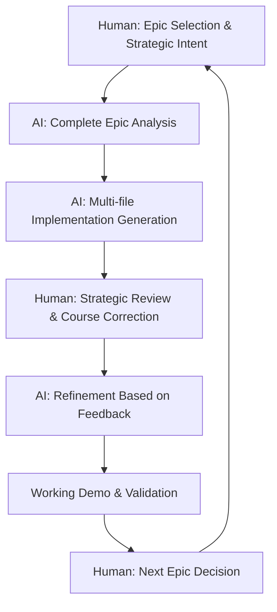

# The Atomic Instructions Anti-Pattern: A Strategic Analysis

> **Type:** Analysis  
> **Category:** Development Process Anti-Patterns  
> **Related:** [idgl-philosophy.md](../concept/idgl-philosophy.md), [platform-process-systematization.md](../platform-processes/platform-process-systematization.md)  
> **Status:** Strategic Analysis & Solution Framework  

---

## Executive Summary

The atomic instructions approach represents a fundamental **inversion of IDGL principles**, transforming what should be a strategic, AI-augmented development process into a bureaucratic task management system. This analysis identifies the anti-pattern, provides root cause analysis, and offers strategic solutions aligned with the Intent-Driven Generative Lifecycle (IDGL) philosophy.

**Key Finding:** Over-atomization destroys the strategic coherence that makes human-AI collaboration powerful, replacing strategic direction with administrative overhead.

> **Note:** This analysis led to the development of our canonical [IDGL Philosophy](../concept/idgl-philosophy.md) which addresses these anti-patterns systematically.

---

## The Anti-Pattern Defined

### What Was Intended (IDGL Vision)


### What Was Actually Built (Atomic Instructions)


**The Fundamental Inversion:** The system designed to eliminate cognitive load instead maximized it by fragmenting strategic work into administrative minutiae.

---

## Root Cause Analysis: The Five Critical Failures

### 1. Loss of Strategic Autonomy ("Not Controllable")
**Manifestation:** The development process controls the developer instead of serving them.

**Root Cause:** Abdication of strategic decision-making to a rigid task queue system.

**Evidence:**
- 91 predetermined instructions with fixed dependencies
- No mechanism for strategic pivots based on learning
- Process becomes more important than outcomes
- Developer reduced to instruction follower

**Strategic Impact:** Eliminates the human's primary value-add—strategic thinking and course correction.

### 2. Cognitive Load Explosion ("Lacks Harmony")
**Manifestation:** Constant context switching destroys flow state and coherent mental models.

**Root Cause:** Artificial fragmentation of naturally cohesive work into micro-tasks.

**Evidence:**
- Context switching between 91 separate concerns
- Each task requires mental setup/teardown overhead
- No unified mental model of the system being built
- Developer cannot maintain architectural vision

**Strategic Impact:** Transforms skilled engineering into assembly-line task execution.

### 3. Process Overhead Exceeds Value Creation ("Too Much Time")
**Manifestation:** More time spent on task management than actual development.

**Root Cause:** Over-engineering the development process itself.

**Evidence:**
- Complex progress tracking infrastructure
- Administrative tasks (marking complete, checking dependencies)
- Multiple coordination files and status systems
- Process maintenance becomes primary activity

**Strategic Impact:** Process complexity consumes resources meant for product development.

### 4. No Value Delivery Milestones ("Carpet Making")
**Manifestation:** Building everything simultaneously with no demonstrable progress until 100% completion.

**Root Cause:** Lack of vertical slice thinking and iterative value delivery.

**Evidence:**
- No working software until all 91 instructions complete
- Cannot validate assumptions or gather feedback
- No intermediate demonstrations possible
- All-or-nothing delivery approach

**Strategic Impact:** Eliminates learning opportunities and increases project risk.

### 5. Over-Engineering Anti-Pattern ("Cycle Reinvention")
**Manifestation:** The development process became more complex than the software being built.

**Root Cause:** Mistaking granularity for precision and process for progress.

**Evidence:**
- Standard NestJS patterns fragmented into atomic pieces
- Development process requires its own documentation and maintenance
- Lost sight of established, proven workflows
- More effort spent on process than product

**Strategic Impact:** Creates technical debt in the development process itself.

---

## The IDGL Alignment Failure

### How Atomic Instructions Violated Core IDGL Principles

#### **Principle 1: Human as Strategic Director**
- **IDGL Intent:** Humans provide high-level strategic guidance and course correction
- **Atomic Reality:** Humans reduced to task executors following predetermined micro-instructions
- **Violation:** Eliminated strategic decision-making in favor of administrative compliance

#### **Principle 2: AI as Strategic Planner**
- **IDGL Intent:** AI analyzes entire conceptual vision and generates holistic roadmaps
- **Atomic Reality:** AI relegated to task tracking and dependency management
- **Violation:** Wasted AI's holistic analysis capabilities on bureaucratic coordination

#### **Principle 3: AI as Implementation Weaver**
- **IDGL Intent:** AI generates complete, multi-file solutions in single operations
- **Atomic Reality:** AI fragments coherent implementations into disconnected pieces
- **Violation:** Destroyed the AI's ability to maintain architectural coherence

#### **Principle 4: Iterative Value Delivery**
- **IDGL Intent:** Generate → Review → Refine cycles with working software at each stage
- **Atomic Reality:** Linear task completion with no intermediate value delivery
- **Violation:** Eliminated feedback loops and learning opportunities

---

## Strategic Solution Framework

### Phase 1: Strategic Reset and Realignment

#### **Immediate Actions**
1. **Archive Atomic System:** Preserve learnings but cease active use
2. **Extract Valuable Patterns:** Salvage useful scaffolding templates and patterns
3. **Assess Existing Work:** Audit `listnest-be-gen` for reusable components
4. **Return to Conceptual Foundation:** Re-examine ListNest philosophy and requirements

#### **Strategic Reassessment**
- Conduct 5-paragraph trade-off analysis of implementation approaches
- Ask 4-6 clarifying questions about true priorities and constraints
- Map conceptual vision to actual backend requirements
- Identify genuine MVP scope vs. over-engineering

### Phase 2: Epic-Driven Architecture Design

#### **IDGL-Aligned Epic Strategy**
Replace 91 atomic instructions with 3-5 strategic epics:

```yaml
Epic 001: Foundation & Authentication
  Strategic Value: Working user system with role-based access
  Implementation Scope: Complete auth module + tests + documentation
  Success Criteria: User can register, login, access role-appropriate content
  Time Investment: 1-2 weeks
  Demonstration: Live authentication flow

Epic 002: Core Business Logic
  Strategic Value: Native list/item management with permissions
  Implementation Scope: Complete CRUD + sharing + audit trail
  Success Criteria: User can create, manage, and share lists with items
  Time Investment: 2-3 weeks
  Demonstration: Full list management workflow

Epic 003: Integration Layer
  Strategic Value: External tool connections (Google Calendar, Jira, etc.)
  Implementation Scope: Integration service + unified item view
  Success Criteria: User sees native + integrated items in single interface
  Time Investment: 2-3 weeks
  Demonstration: Unified inbox functionality

Epic 004: Intelligence Layer
  Strategic Value: AI-powered prioritization and recommendations
  Implementation Scope: AI engine + recommendation algorithms
  Success Criteria: AI suggests "what to do next" across all data sources
  Time Investment: 2-3 weeks
  Demonstration: Intelligent task prioritization
```

#### **Epic Implementation Methodology**
- **Vertical Slice Approach:** Each epic delivers end-to-end working functionality
- **AI as Weaver:** Complete multi-file implementations in single operations
- **Strategic Review Points:** Human validation at epic completion
- **Iterative Refinement:** Feedback incorporation between epics

### Phase 3: IDGL-Native Development Process

#### **Human-AI Collaboration Model**


#### **Quality Gates and Validation**
- **Strategic Alignment:** Each epic must advance ListNest core philosophy
- **Technical Coherence:** AI-generated code must maintain architectural integrity
- **Value Demonstration:** Working software at each epic completion
- **Feedback Integration:** Human insights incorporated into subsequent epics

---

## Implementation Guidelines

### For Strategic Directors (Humans)

#### **Epic Selection Criteria**
- **Business Value:** Does this epic advance the ListNest vision?
- **Technical Foundation:** Does this epic enable future capabilities?
- **Risk Mitigation:** Does this epic validate critical assumptions?
- **User Value:** Can this epic be demonstrated to stakeholders?

#### **Review Focus Areas**
- **Architectural Coherence:** Does the implementation maintain system integrity?
- **Strategic Alignment:** Does the solution advance the overall vision?
- **Quality Standards:** Does the code meet production requirements?
- **Future Flexibility:** Does the implementation enable future extensions?

### For AI Implementation Partners

#### **Epic Analysis Framework**
- **Conceptual Integration:** How does this epic align with ListNest philosophy?
- **Technical Dependencies:** What existing components are required/available?
- **Implementation Scope:** What files, modules, and tests are needed?
- **Integration Points:** How does this epic connect to other system components?

#### **Implementation Generation Standards**
- **Complete Solutions:** Generate all necessary files in single operation
- **Test Coverage:** Include comprehensive test suites with implementation
- **Documentation:** Generate inline documentation and README updates
- **Error Handling:** Include robust error handling and validation

---

## Lessons Learned and Best Practices

### **Anti-Pattern Recognition Signs**
Watch for these indicators of process over-engineering:

1. **Process Documentation > Product Documentation:** More effort documenting the process than the product
2. **Administrative Overhead > Development Time:** More time on tracking than building
3. **Task Switching > Deep Work:** Constant context switching without sustained focus
4. **Process Maintenance > Feature Development:** Process becomes its own project
5. **Granularity Without Purpose:** Breaking down work that's naturally cohesive

### **IDGL Success Indicators**

1. **Strategic Control:** Human maintains decision-making autonomy
2. **AI Augmentation:** AI enhances rather than replaces human judgment
3. **Value Delivery:** Working software at regular intervals
4. **Feedback Integration:** Ability to adapt based on learning
5. **Sustainable Pace:** Process supports rather than hinders productivity

### **Process Evolution Guidelines**

#### **Regular Process Audits**
- Monthly assessment: Is the process serving the project or vice versa?
- Feedback collection: What's working, what's hindering progress?
- Adaptation: Adjust based on real experience, not theoretical ideals

#### **Continuous Alignment**
- Vision Check: Does current work advance the ListNest philosophy?
- Technical Health: Is the architecture remaining coherent?
- Team Health: Is the process sustainable for contributors?

---

## Conclusion and Strategic Recommendations

The atomic instructions approach represents a textbook example of how good intentions—precision, thoroughness, systematic approach—can create anti-patterns when applied without strategic thinking. The fundamental error was **optimizing for process completeness rather than outcome effectiveness**.

### **Core Recommendations**

1. **Return to IDGL Fundamentals:** Restore the human-AI strategic partnership model
2. **Epic-Driven Development:** Replace atomic tasks with strategic, demonstrable epics
3. **Value-First Approach:** Prioritize working software over process documentation
4. **Strategic Control:** Maintain human decision-making authority over AI recommendations
5. **Iterative Validation:** Build feedback loops into every epic cycle

### **Strategic Success Metrics**

- **Time to Value:** Working features delivered in weeks, not months
- **Strategic Agility:** Ability to pivot based on learning and feedback
- **Technical Quality:** Maintainable, well-architected solutions
- **Process Sustainability:** Development approach that energizes rather than drains
- **Vision Alignment:** Each epic advances the ListNest philosophy

### **Next Steps**

1. **Immediate:** Archive atomic instructions, assess existing backend components
2. **Short-term:** Design epic-driven architecture aligned with ListNest vision
3. **Medium-term:** Implement first strategic epic with AI as implementation weaver
4. **Long-term:** Establish IDGL-native development culture and practices

The path forward is clear: **Less process, more strategy. Less atomization, more orchestration. Less administration, more creation.**

---

**Related Documents:**
- [IDGL Rationale](../../idgl-rationale.md) - Foundational philosophy
- [AI Participation Rules](../../ai-participation-rules.md) - Human-AI collaboration guidelines
- [Epic Conventions](../../epic-conventions.md) - Strategic implementation standards
- [Solo Fullstack Workflow](../../solo-fullstack-workflow.md) - Individual developer guidance

**Status:** Active Principle - Use for all future development process decisions 