# IDGL Meta Documentation

> **Intent-Driven Generative Lifecycle (IDGL)** - A systematic approach to AI-assisted software development through platform-specific processes
> 
> **Status:** 🟢 **PRODUCTION READY** - Core principles established with working implementations  
> **Version:** 2024-12 - Platform-Process Systematization Era

---

## 🎯 **Quick Navigation**

| Need | Go To | Description |
|------|-------|-------------|
| **Learn IDGL** | [`00-concept/`](./00-concept/) | Philosophy, methodology, and foundational principles |
| **Implement System** | [`01-platform-processes/`](./01-platform-processes/) | Systematic processes for specific technology platforms |
| **Use Templates** | [`02-templates/`](./02-templates/) | Proven patterns for intents and processes |
| **See Examples** | [`03-examples/`](./03-examples/) | Real-world implementations and demonstrations |
| **Deep Dive** | [`04-principles/`](./04-principles/) | Detailed guidance and implementation principles |

---

## 🏗️ **Core IDGL Architecture**

### **The Platform-Process Systematization Principle**

IDGL is built on one fundamental insight: **Define systematic processes for each technology platform that generate complete, working software**. 

- **Not about:** Micro-task coordination or tooling automation
- **Actually about:** Comprehensive, repeatable processes that ensure complete software generation
- **Evidence:** ListNest case study shows 186 atomic files = paralysis, while 1 platform process = working software

### **Sequential Learning Path**
1. **`00-concept/`** - **UNDERSTAND** 🧠 (Philosophy and principles)
2. **`01-platform-processes/`** - **SYSTEMATIZE** ⚙️ (Systematic generation processes)  
3. **`02-templates/`** - **STANDARDIZE** 📝 (Reusable patterns)
4. **`03-examples/`** - **DEMONSTRATE** 💡 (Real implementations)
5. **`04-principles/`** - **DETAIL** 🎓 (Implementation guidance)

### **Three-Layer Learning Architecture**

```mermaid
graph TD
    A[🎯 IDGL Core] --> B[📚 Concept Foundation]
    A --> C[⚙️ Platform Processes] 
    A --> D[🎓 Implementation Guidance]
    
    B --> B1[Philosophy & Principles]
    B --> B2[Methodology & Partnership]
    B --> B3[Systematic Approach]
    
    C --> C1[NestJS Backend Process ✅]
    C --> C2[React Frontend Process 🔄]
    C --> C3[More Platforms... 📋]
    
    D --> D1[Templates & Patterns]
    D --> D2[Examples & Demos]
    D --> D3[Principles & Guidelines]
    
    style A fill:#1976d2,color:#fff
    style B fill:#388e3c,color:#fff
    style C fill:#f57c00,color:#fff
    style D fill:#7b1fa2,color:#fff
```

### **Visual Navigation**

```mermaid
graph TD
    A["🎯 IDGL Documentation"] --> B["📚 00-concept/"]
    A --> C["⚙️ 01-platform-processes/"]
    A --> D["📝 02-templates/"]
    A --> E["💡 03-examples/"]
    A --> F["🎓 04-principles/"]
    
    B --> B1["IDGL Definition"]
    B --> B2["IDGL Philosophy"]
    B --> B3["IDGL Methodology"]
    
    C --> C1["Platform Systematization Guide"]
    C --> C2["NestJS Backend Process"]
    
    D --> D1["Template Collection Guide"]
    D --> D2["Intent Templates"]
    
    E --> E1["Intent Examples"]
    E --> E2["Process Examples"]
    
    F --> F1["Core Principles"]
    F --> F2["Implementation Patterns"]
    
    style B fill:#e1f5fe,color:#000
    style B1 fill:#e8f5e8,color:#000
    style B2 fill:#e8f5e8,color:#000
    style B3 fill:#e8f5e8,color:#000
```

---

## 📁 **Documentation Structure**

### 📚 **[00-concept/](./00-concept/)** - **START HERE**
**Foundation: What is IDGL and why does it work?**

- **[concept-index.md](./00-concept/concept-index.md)** - Navigation and usage guide
- **[idgl-definition.md](./00-concept/idgl-definition.md)** - Core definition and scope
- **[idgl-philosophy.md](./00-concept/idgl-philosophy.md)** - Principles and mindset
- **[idgl-methodology.md](./00-concept/idgl-methodology.md)** - Human-AI partnership patterns
  - *Includes: Fullstack Developer + AI Assistant Partnership*

**🎯 Purpose:** Establish foundational understanding before exploring implementations

---

### ⚙️ **[01-platform-processes/](./01-platform-processes/)** - Core Implementation
**Working Systems: Proven processes that generate complete software**

- **[platform-systematization-guide.md](./01-platform-processes/platform-systematization-guide.md)** - Core principle and approach
- **[nestjs/](./01-platform-processes/nestjs/)** - Complete NestJS backend generation ✅
  - **[nestjs-complete-process.md](./01-platform-processes/nestjs/nestjs-complete-process.md)** - Complete implementation guide
  - **[input-parameters.md](./01-platform-processes/nestjs/input-parameters.md)** - Comprehensive configuration
  - **[phases-overview.md](./01-platform-processes/nestjs/phases-overview.md)** - Detailed phase breakdown
- **[atomic-decomposition-workflow.md](./01-platform-processes/atomic-decomposition-workflow.md)** - Legacy workflow reference

**🎯 Purpose:** Generate working software through systematic processes

---

### 📝 **[02-templates/](./02-templates/)** - Reusable Patterns
**Standards: Proven patterns that embody IDGL principles**

- **[template-collection-guide.md](./02-templates/template-collection-guide.md)** - Template philosophy and usage
- **[intent-template-solo-dev.md](./02-templates/intent-template-solo-dev.md)** - Standard intent structure
- **[ui-ux-intent-example-template.md](./02-templates/ui-ux-intent-example-template.md)** - Interface design patterns
- **[epic-deliverables-template.md](./02-templates/epic-deliverables-template.md)** - Project milestone structure

**🎯 Purpose:** Standardize implementation through proven patterns

---

### 💡 **[03-examples/](./03-examples/)** - Real Demonstrations
**Validation: See IDGL principles working in practice**

- **[intents/](./03-examples/intents/)** - Complete intent examples across domains

**🎯 Purpose:** Demonstrate IDGL effectiveness through concrete examples

---

### 🎓 **[04-principles/](./04-principles/)** - Implementation Guidance
**Expertise: Detailed guidance for specific implementation aspects**

#### 🔥 **Core Principles**
- **[platform-process-systematization-principle.md](./04-principles/platform-process-systematization-principle.md)** - **THE FOUNDATION**
- **[platform-process-systematization-evidence.md](./04-principles/platform-process-systematization-evidence.md)** - **PROOF FROM LISTNEST CASE STUDY**
- **[atomic-instructions-anti-pattern-analysis.md](./04-principles/atomic-instructions-anti-pattern-analysis.md)** - **CRITICAL LEARNING**

#### 🎨 **AI Integration Principles**
- **[ai-assisted-ui-ux-design-principles.md](./04-principles/ai-assisted-ui-ux-design-principles.md)**
- **[ai-role-and-detailing-principle.md](./04-principles/ai-role-and-detailing-principle.md)**
- **[ai-encouragement.md](./04-principles/ai-encouragement.md)**
- **[ai-encouragement-why-intents-for-solo-dev.md](./04-principles/ai-encouragement-why-intents-for-solo-dev.md)**

#### 📋 **Intent Management**
- **[unified-intent-definition.md](./04-principles/unified-intent-definition.md)**
- **[unified-intent-structure-guide.md](./04-principles/unified-intent-structure-guide.md)**
- **[unified-intent-action-types.md](./04-principles/unified-intent-action-types.md)**
- **[intent-enriched-format-principle.md](./04-principles/intent-enriched-format-principle.md)**

#### 🔄 **Pattern Libraries**
- **[unified-action-mid-level-pattern-library.md](./04-principles/unified-action-mid-level-pattern-library.md)**
- **[idgl-vs-user-stories.md](./04-principles/idgl-vs-user-stories.md)**

**🎯 Purpose:** Provide detailed implementation guidance and best practices

---

## 🛣️ **User Journey Guides**

### 🆕 **New to IDGL?** (Learn IDGL)
1. **[Read Philosophy](./00-concept/idgl-philosophy.md)** - Understand the mindset
2. **[Study Evidence](./04-principles/platform-process-systematization-evidence.md)** - See proof it works
3. **[Explore Examples](./03-examples/)** - See it in action
4. **[Use Templates](./02-templates/)** - Apply proven patterns

### ⚙️ **Ready to Implement?** (Build IDGL Process)
1. **[Platform Systematization Guide](./01-platform-processes/platform-systematization-guide.md)** - Core approach
2. **[NestJS Complete Process](./01-platform-processes/nestjs/nestjs-complete-process.md)** - Working example
3. **[Template Patterns](./02-templates/)** - Standardize your approach
4. **[Principles](./04-principles/)** - Deep implementation guidance

### 🤖 **AI-Assisted Development?** (Leverage IDGL with AI)
1. **[IDGL Methodology](./00-concept/idgl-methodology.md)** - Human-AI partnership
2. **[AI Principles](./04-principles/)** - AI integration guidance
3. **[Platform Processes](./01-platform-processes/)** - AI-assisted generation
4. **[Intent Templates](./02-templates/)** - Structure AI interactions

---

## 🏗️ **Architecture Success**

### **What We Achieved:**
- **Clear Authority Hierarchy** - Each layer builds on the previous
- **Meaningful Filenames** - No generic "README.md" files (except this main entry point)
- **Flat Structure** - Easy navigation without unnecessary nesting
- **Complete Learning System** - From philosophy to practical implementation
- **Systematic Generation** - Proven processes for working software

### **Key Principles:**
1. **Start with Concept** - Clear foundational definitions establish everything
2. **Apply Systematic Processes** - Use proven generation approaches
3. **Maintain Consistency** - Leverage templates and standards
4. **Learn from Examples** - Reference proven implementations
5. **Follow Detailed Guidance** - Apply specific principles and best practices

---

## 🤝 **Core Integration: Human-AI Partnership**

**Partnership Model** (Successfully extracted and integrated):
- **Human Strategic Role**: Intent definition, prioritization, architecture decisions
- **AI Tactical Role**: Solution generation, boilerplate, refactoring, consistency
- **Collaboration Patterns**: Intent-to-implementation flow, rapid learning cycles
- **Success Indicators**: Clear metrics for effective partnership

**Location**: [IDGL Methodology - Partnership Section](./00-concept/idgl-methodology.md#fullstack-developer--ai-assistant-partnership)

---

## 🏆 **Key Success Factors**

### **What Makes IDGL Work**
1. **Platform-Specific Processes** - Tailored to each technology stack
2. **Complete System Generation** - Working software, not fragments
3. **Human-AI Partnership** - Strategic humans, tactical AI
4. **Evidence-Based Approach** - Proven through real case studies

### **What IDGL Is NOT**
- ❌ **Micro-task coordination** (atomic instructions anti-pattern)
- ❌ **Generic tooling automation** (platform-agnostic approaches)
- ❌ **Documentation-heavy processes** (analysis paralysis)
- ❌ **AI-first development** (AI without human strategy)

### **What IDGL IS**
- ✅ **Systematic software generation** through platform processes
- ✅ **Complete working systems** as immediate output
- ✅ **Strategic human guidance** with tactical AI assistance
- ✅ **Evidence-based methodology** validated through case studies

---

## 📊 **Current Status & Roadmap**

### ✅ **Established (Production Ready)**
- **Platform-Process Systematization** - Core principle with NestJS implementation
- **Atomic Instructions Anti-Pattern Analysis** - Critical learnings documented
- **Foundational Concepts** - Philosophy, methodology, and definitions
- **Template System** - Proven patterns for implementation
- **Evidence Base** - ListNest case study proves effectiveness

### 🔄 **In Development** (Focus Areas)
- **Additional Platform Processes** - React, Flutter, Express.js
- **Cross-Platform Integration** - Full-stack system generation
- **Example Library** - More real-world demonstrations
- **Process Validation** - Use existing processes to generate actual systems

### 📋 **Future Vision**
- **Platform Process Marketplace** - Community-contributed processes
- **Automated Process Validation** - Ensure process completeness
- **Enterprise Integration** - Organization-wide IDGL adoption

---

## 🤝 **Contributing & Community**

### **How to Contribute**
1. **Study existing processes** - Understand current patterns
2. **Create platform processes** - Add new technology platforms
3. **Share evidence** - Document your success stories
4. **Improve documentation** - Clarify and enhance guidance

### **Community Standards**
- **Evidence-based contributions** - Show working examples
- **Complete implementations** - No partial or theoretical processes
- **Clear documentation** - Follow established patterns
- **Systematic approach** - Align with IDGL principles

---

## 📚 **Additional Resources**

- **[ListNest Case Study](./04-principles/platform-process-systematization-evidence.md)** - Real-world evidence
- **[Anti-Pattern Analysis](./04-principles/atomic-instructions-anti-pattern-analysis.md)** - Learn from failures
- **[Platform-Process Systematization](./04-principles/platform-process-systematization-principle.md)** - Core principle

---

## 🔧 **Removed (Lessons Learned)**

### **What We Eliminated and Why:**
- ~~**Workflow Orchestration**~~ - Premature optimization before having multiple processes
- ~~**Action Pattern Libraries**~~ - Recreated atomic instructions anti-pattern
- ~~**Intent Experimentation**~~ - Over-engineered intent management
- ~~**Generic README.md files**~~ - Replaced with meaningful filenames throughout

### **Key Learning:**
Focus on **complete working systems** rather than **administrative processes**. Every removed element was contributing to analysis paralysis rather than software generation.

---

**🎯 Remember:** IDGL is about generating working software through systematic processes, not managing development tasks through administrative overhead.

**This documentation represents a focused, practical approach to IDGL implementation based on real experience and validated learnings. Start with [Platform-Process Systematization](./04-principles/platform-process-systematization-principle.md) to understand the core principle.** 