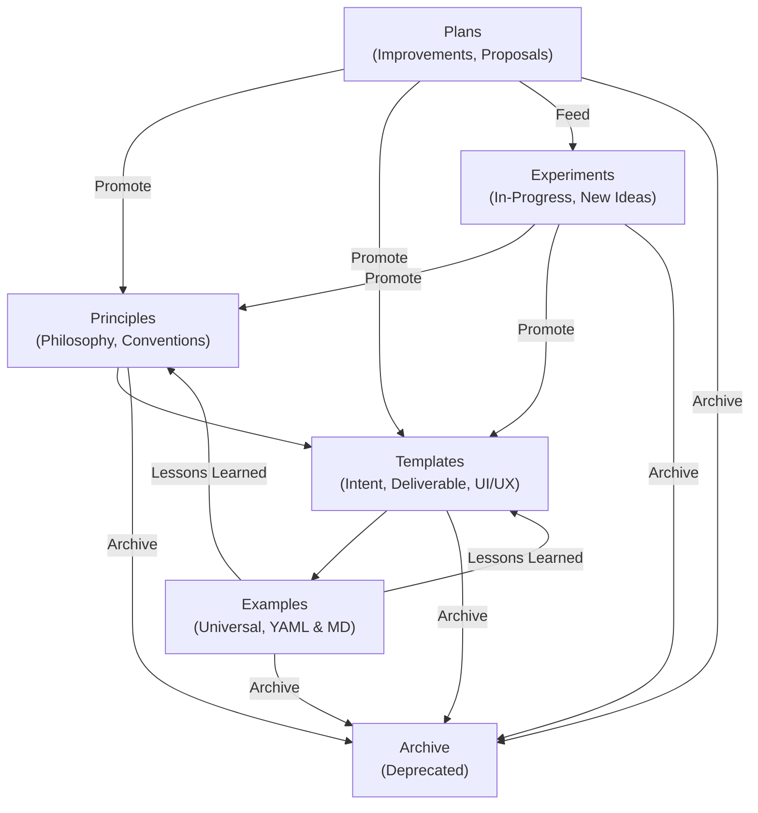

# Intent Atlas Map

This map shows how the core elements of the Intent Atlas connect and guide your documentation journey. Use it to navigate from foundational principles, through templates, to real-world examples—and back again as you learn and improve.

## Navigation Narrative
- **Start with Principles:** Understand the philosophy and conventions.
- **Move to Templates:** Use or adapt templates for new intents.
- **See Examples:** Review universal examples for inspiration and best practices.
- **Propose in Plans:** Suggest improvements or new patterns.
- **Experiment:** Try new ideas in the experiments section.
- **Archive:** Retire outdated or superseded docs, but keep them for reference.
- **Feedback Loop:** Lessons from examples, plans, and experiments should inform and evolve the principles and templates.

---
**You are here:** [Intent Atlas Map] 