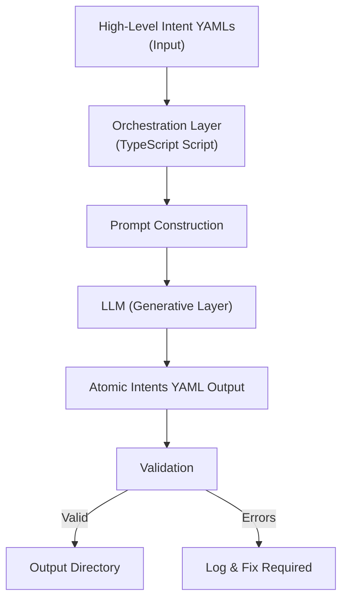

# Atomic Decomposition Workflow (Experiment)

This document provides a visual overview of the atomic decomposition process as implemented in the ListNest project. It is intended to help both technical and non-technical stakeholders understand the end-to-end flow from high-level intent to atomic, testable requirements.

---

## Workflow Diagram

---

## Narrative
1. **Input:** High-level intent YAML files are placed in the source directory.
2. **Orchestration Layer:** The TypeScript script reads each file, constructs a canonical prompt, and manages the workflow.
3. **Prompt Construction:** The script builds a standards-compliant prompt for the LLM.
4. **LLM (Generative Layer):** The LLM receives the prompt and generates atomic intents in YAML format.
5. **Output Parsing:** The script parses the LLM's YAML output.
6. **Validation:** The script checks for required fields, correct formats, and cross-referencing.
7. **Output:** Valid atomic intents are written to the output directory. Errors are logged for review and must be resolved before proceeding.

---

*For more details on each step, see the main script description and canonical documentation.* 