```mermaid
flowchart TD
    A[New Developer] --> B{What do you need?}
    
    B -->|Quick Setup| C[📖 5-Minute Quick Start]
    B -->|Understanding System| D[🏗️ Architecture Overview]
    B -->|API Development| E[🔌 API Endpoints Guide]
    B -->|Database Work| F[💾 Domain Models]
    B -->|Business Logic| G[📋 Business Rules]
    B -->|Advanced Patterns| H[⚡ Implementation Patterns]
    B -->|Deployment| I[🚀 Production Guide]
    B -->|Troubleshooting| J[🔧 FAQ & Troubleshooting]
    
    C --> K[Start Developing]
    D --> L[Review Architecture]
    E --> M[Build Features]
    F --> N[Model Data]
    G --> O[Implement Rules]
    H --> P[Advanced Development]
    I --> Q[Deploy System]
    J --> R[Solve Problems]
    
    K --> S[🎯 Contributing to Codebase]
    L --> S
    M --> S
    N --> S
    O --> S
    P --> S
    Q --> S
    R --> S
```

# WishListShare: Expert-Level Backend Documentation

This documentation provides a comprehensive, expert-level overview of the WishListShare wishlist service backend. It includes conceptual documentation, architectural diagrams, API flows, business rules, and actionable recommendations for onboarding, architecture review, and extensibility.

---

## 🚀 **5-Minute Quick Start**

### **Prerequisites**
```bash
# Required tools
- Node.js 18+ 
- PostgreSQL 12+
- npm or yarn
```

### **Rapid Setup**
```bash
# 1. Clone and install
git clone <repository>
cd wishlistshare-backend
npm install

# 2. Database setup
createdb nest_project
# Configure: host=localhost, port=5432, user=student, password=student

# 3. Start development
npm run start:dev
# ✅ Backend running at http://localhost:3000

# 4. Verify setup
curl http://localhost:3000/users
# ✅ Should return user list
```

### **First API Test**
```bash
# Test authentication
curl -X POST http://localhost:3000/auth/signup \
  -H "Content-Type: application/json" \
  -d '{"username":"testuser","email":"test@example.com","password":"password123"}'

# ✅ You're ready to develop!
```

---

## 🗺️ **Visual Navigation & Developer Flowchart**



---

## 🚀 **5-Minute Quick Start**

### **Prerequisites**
```bash
# Required tools
- Node.js 18+ 
- PostgreSQL 12+
- npm or yarn
```

### **Rapid Setup**
```bash
# 1. Clone and install
git clone <repository>
cd wishlistshare-backend
npm install

# 2. Database setup
createdb nest_project
# Configure: host=localhost, port=5432, user=student, password=student

# 3. Start development
npm run start:dev
# ✅ Backend running at http://localhost:3000

# 4. Verify setup
curl http://localhost:3000/users
# ✅ Should return user list
```

### **First API Test**
```bash
# Test authentication
curl -X POST http://localhost:3000/auth/signup \
  -H "Content-Type: application/json" \
  -d '{"username":"testuser","email":"test@example.com","password":"password123"}'

# ✅ You're ready to develop!
```

---

## 🗺️ **Visual Navigation & Developer Flowchart**


---

## 📚 **Documentation Map**

### **🏗️ Core Architecture**
| File | Purpose | When to Use |
|------|---------|-------------|
| [architecture.md](./architecture.md) | System design, modules, patterns | Understanding overall structure |
| [domain-models.md](./domain-models.md) | Data models, relationships, ER diagrams | Database and entity work |

### **🔌 API & Development**  
| File | Purpose | When to Use |
|------|---------|-------------|
| [controller-endpoints.md](./controller-endpoints.md) | API routes, request/response patterns | Building frontend integration |
| [service-responsibilities.md](./service-responsibilities.md) | Business logic organization | Understanding service layer |
| [api-flows.md](./api-flows.md) | Sequence diagrams, process flows | Complex operation understanding |

### **📋 Business Logic & Rules**
| File | Purpose | When to Use |
|------|---------|-------------|
| [business-rules.md](./business-rules.md) | Validation, constraints, business logic | Implementing features correctly |
| [localization-context.md](./localization-context.md) | Cultural context, internationalization | Multi-language support |

### **⚡ Advanced Development**
| File | Purpose | When to Use |
|------|---------|-------------|
| [implementation-patterns.md](./implementation-patterns.md) | Advanced patterns, optimization | Complex technical implementations |
| [concept-analysis.md](./concept-analysis.md) | Documentation completeness analysis | Quality assurance, gaps |
| [recommendations.md](./recommendations.md) | Best practices, extensibility | Code review, architecture decisions |

### **🚀 Production & Operations**
| File | Purpose | When to Use |
|------|---------|-------------|
| [production-deployment.md](./production-deployment.md) | **NEW** Deployment, scaling, monitoring | Going to production |
| [testing-strategy.md](./testing-strategy.md) | **NEW** Testing approaches, examples | Writing tests |
| [troubleshooting.md](./troubleshooting.md) | **NEW** Common issues, solutions | Debugging problems |

---

## 💡 **Code Examples at a Glance**

### **Creating a New Wish**
```typescript
// POST /wishes
const newWish = {
  name: "Mechanical Keyboard",
  price: 150.00,
  description: "Gaming keyboard with RGB",
  link: "https://example.com/keyboard",
  image: "https://example.com/keyboard.jpg"
};

// ✅ Returns: Wish entity with auto-generated fields
// copied: 0, raised: 0, owner: currentUser
```

### **Making an Offer**
```typescript
// POST /offers
const offer = {
  amount: 50.00,
  hidden: false  // Show contributor publicly
};

// ✅ Business rules automatically enforced:
// - Cannot exceed (wish.price - wish.raised)
// - Cannot offer on own wishes
// - Updates wish.raised amount atomically
```

### **Authentication Flow**
```typescript
// 1. Signup
POST /auth/signup → { access_token: "jwt..." }

// 2. Use token in headers
Authorization: Bearer <jwt-token>

// 3. Access protected endpoints
GET /wishes → Returns user's wishes + public wishes
```

---

## 🏗️ **Project Mission and Context**

WishListShare is a gift wishlist service that enables collective gift-giving through community funding. This modular, scalable backend is built with NestJS and TypeORM, implementing sophisticated business rules for gift management, offer processing, and localization.

### **🎯 Key Features**
- **Collective Gift Funding:** Users contribute money toward others' desired gifts
- **Localization Support:** Full internationalization support and cultural context  
- **Advanced Privacy Controls:** Optional anonymity and owner-based data filtering
- **Sophisticated Business Logic:** Complex validation, transaction management, and security patterns

### **👥 Target Audience**
This documentation is intended for backend and full-stack developers, architects, and contributors who need comprehensive understanding of the system's design, business logic, cultural context, and advanced implementation patterns.

---

## 🔧 **Common Developer Tasks**

### **Adding a New Feature**


### **Debugging Issues**


---

## ⚡ **Key Architectural Decisions**

| Decision | Rationale | Impact |
|----------|-----------|--------|
| **Modular Design** | Each domain (users, wishes, offers) in separate modules | Clear boundaries, easy testing |
| **Service Layer** | Business logic in services, not controllers | Single responsibility, reusability |
| **DTO Validation** | class-validator decorators on all inputs | Data integrity, security |
| **JWT Authentication** | Stateless token-based auth | Scalability, mobile-friendly |
| **TypeORM with PostgreSQL** | Strong typing, relation management | Developer productivity, data consistency |
| **Global Exception Filters** | Centralized error handling | Consistent API responses |

---

## 🎯 **Developer Onboarding Checklist**

### **Day 1: Environment Setup**
- [ ] Complete 5-minute quick start
- [ ] Review architecture overview  
- [ ] Test all API endpoints with Postman/curl
- [ ] Run existing tests: `npm test`

### **Day 2: Understanding Business Logic**
- [ ] Read business rules documentation
- [ ] Review domain models and relationships
- [ ] Understand authentication flow
- [ ] Study implementation patterns

### **Day 3: First Contribution**
- [ ] Pick up a small bug fix or feature
- [ ] Write tests for your changes
- [ ] Follow code review checklist
- [ ] Update relevant documentation

### **Ongoing: Best Practices**
- [ ] Keep documentation updated with code changes
- [ ] Follow established patterns and conventions
- [ ] Write comprehensive tests
- [ ] Use proper error handling patterns

---

## 🔧 **Troubleshooting Quick Fixes**

| Problem | Quick Solution |
|---------|----------------|
| **Database connection error** | Check PostgreSQL running, verify credentials in config |
| **JWT authentication failing** | Verify JWT secret in environment variables |
| **Validation errors on API calls** | Check DTO structure in business-rules.md |
| **Tests failing** | Run `npm run test:watch` and check recent changes |
| **Port already in use** | Kill process: `lsof -ti:3000 \| xargs kill -9` |

**For detailed troubleshooting:** See [troubleshooting.md](./troubleshooting.md)

---

## 📈 **Performance & Scalability Considerations**

- **Database Optimization:** Proper indexing on search fields (email, username)
- **Query Efficiency:** Selective relation loading based on authentication status
- **Caching Strategy:** Consider Redis for frequently accessed data
- **Rate Limiting:** Implement rate limiting for API endpoints
- **Monitoring:** Set up application performance monitoring (APM)

**Detailed guide:** [production-deployment.md](./production-deployment.md)

---

## 🤝 **Contributing & Maintenance**

### **Documentation Updates**
- Update diagrams using [Mermaid Live Editor](https://mermaid-js.github.io/mermaid-live-editor/)
- Follow existing documentation structure and style
- Include code examples for new features
- Update cross-references between documents

### **Code Review Process**
- All changes require peer review
- Include documentation updates in PRs
- Run full test suite before merging
- Update relevant diagrams and documentation

---

## 📖 **Additional Resources**

- **[NestJS Documentation](https://docs.nestjs.com/)** - Framework reference
- **[TypeORM Documentation](https://typeorm.io/)** - ORM and database patterns
- **[PostgreSQL Documentation](https://www.postgresql.org/docs/)** - Database optimization
- **[JWT.io](https://jwt.io/)** - Authentication token debugging

---

> **This documentation is a living reference.** It evolves with the codebase to ensure ongoing clarity and maintainability. When in doubt, consult the code - it's the ultimate source of truth, and this documentation should always reflect the actual implementation. 