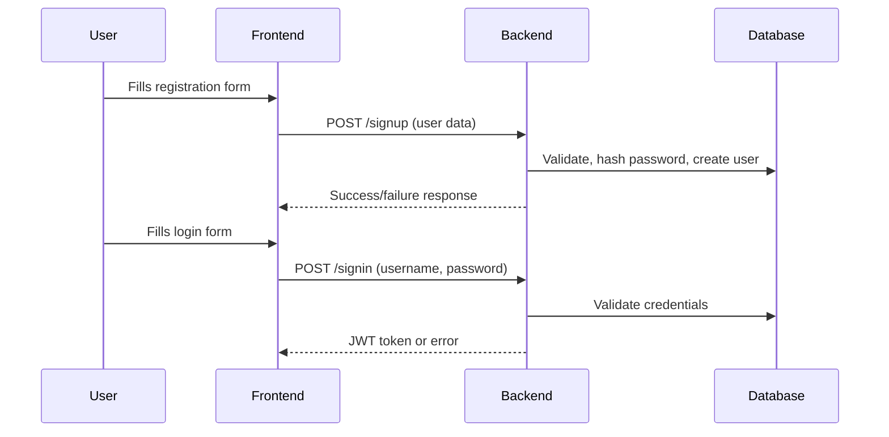
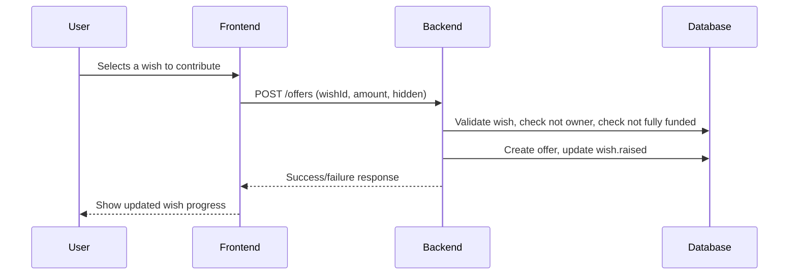
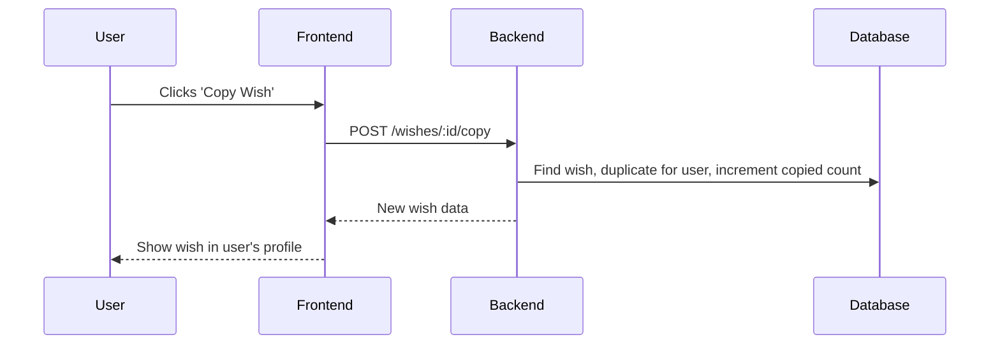

# API Flows and Business Processes

This document provides sequence diagrams and business process flows for key API operations in the WishListShare backend.

---

## Registration & Authentication

---

## Gift Contribution Flow

---

## Wish Copy Flow

