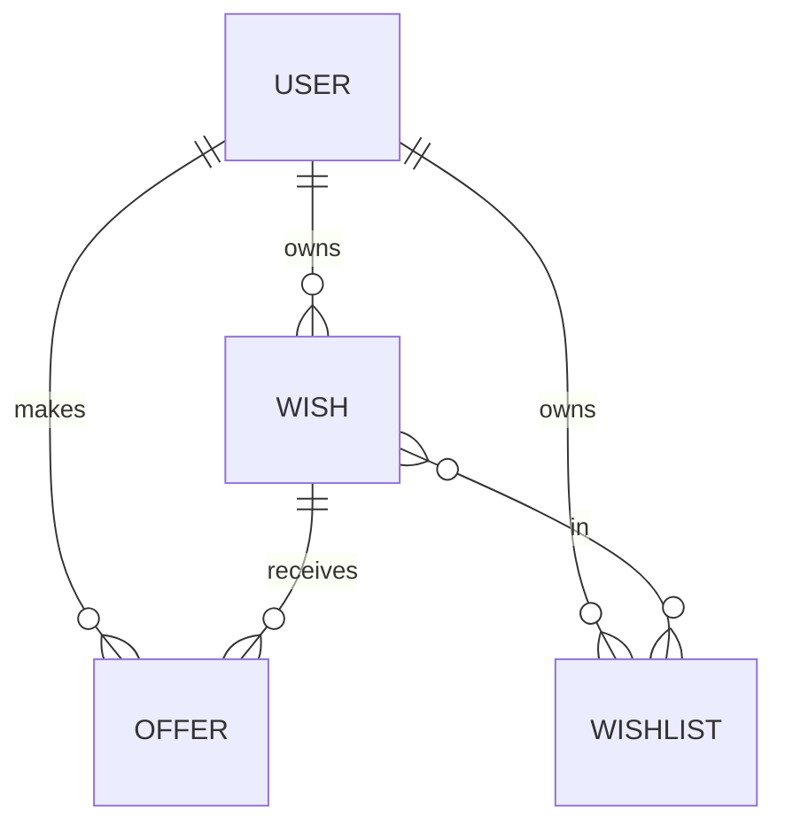

# Domain Models: Properties and Relationships

This document provides an expert-level summary of the main properties, relationships, and validation rules for the core domain models in the WishListShare backend. It integrates detailed field definitions, relationship types, validation decorators, and advanced notes. An ER diagram is included for visual reference.

---

## Entity-Relationship Diagram

---

## User
**Fields:**
- `id`: number (Primary key, auto-generated)
- `createdAt`: Date (auto-generated)
- `updatedAt`: Date (auto-generated)
- `username`: string (unique, required, 2-30 chars, @Length)
- `about`: string (optional, 2-200 chars, @Length, default)
- `avatar`: string (optional, URL, default, @IsUrl)
- `email`: string (unique, required, email format, @IsEmail)
- `password`: string (required, excluded from serialization, @Exclude)

**Relationships:**
- `wishes`: One-to-many with Wish (User owns many Wishes, @OneToMany)
- `offers`: One-to-many with Offer (User makes many Offers, @OneToMany)
- `wishlists`: One-to-many with Wishlist (User owns many Wishlists, @OneToMany)

**Notes:** User is the owner of wishes, offers, and wishlists.

---

## Wish
**Fields:**
- `id`: number (Primary key, auto-generated)
- `createdAt`: Date (auto-generated)
- `updatedAt`: Date (auto-generated)
- `name`: string (required, 1-250 chars, @Length)
- `link`: string (required, URL, @IsUrl)
- `image`: string (required, URL, @IsUrl)
- `price`: number (required, min 1, rounded to 2 decimals, @Min, @Transform)
- `raised`: number (required, min 0, rounded to 2 decimals, @Min, @Transform)
- `description`: string (required, 1-1024 chars, @Length)
- `copied`: number (default 0)

**Relationships:**
- `owner`: Many-to-one with User (Wish is owned by a User, @ManyToOne)
- `wishlists`: Many-to-many with Wishlist (Wish can belong to many Wishlists, @ManyToMany)
- `offers`: One-to-many with Offer (Wish can have many Offers, @OneToMany)

**Notes:** Wish belongs to a user, can be in multiple wishlists, and can have multiple offers.

---

## Wishlist
**Fields:**
- `id`: number (Primary key, auto-generated)
- `createdAt`: Date (auto-generated)
- `updatedAt`: Date (auto-generated)
- `name`: string (required, 1-250 chars, @Length)
- `description`: string (optional, 1-1500 chars, @Length)
- `image`: string (required, URL, @IsUrl)

**Relationships:**
- `items`: Many-to-many with Wish (Wishlist contains many Wishes, @ManyToMany)
- `owner`: Many-to-one with User (Wishlist is owned by a User, @ManyToOne)

**Notes:** Wishlist is owned by a user and contains multiple wishes.

---

## Offer
**Fields:**
- `id`: number (Primary key, auto-generated)
- `createdAt`: Date (auto-generated)
- `updatedAt`: Date (auto-generated)
- `item`: string (required, URL, @IsUrl)
- `amount`: number (required, min 1, rounded to 2 decimals, @Min, @Transform)
- `hidden`: boolean (default false)

**Relationships:**
- `user`: Many-to-one with User (Offer is made by a User, @ManyToOne)
- `wish`: Many-to-one with Wish (Offer is for a Wish, @ManyToOne)

**Notes:** Offer is made by a user for a wish.

---

## General Patterns
- **Validation:** All fields validated with class-validator decorators (@Length, @IsEmail, @IsUrl, @Min, @Transform, @Exclude)
- **Timestamps:** All entities have `createdAt` and `updatedAt` fields managed by TypeORM
- **Relationships:** Associations are explicitly defined using TypeORM decorators (one-to-many, many-to-one, many-to-many)
- **Ownership and business rules:** Enforced in services 