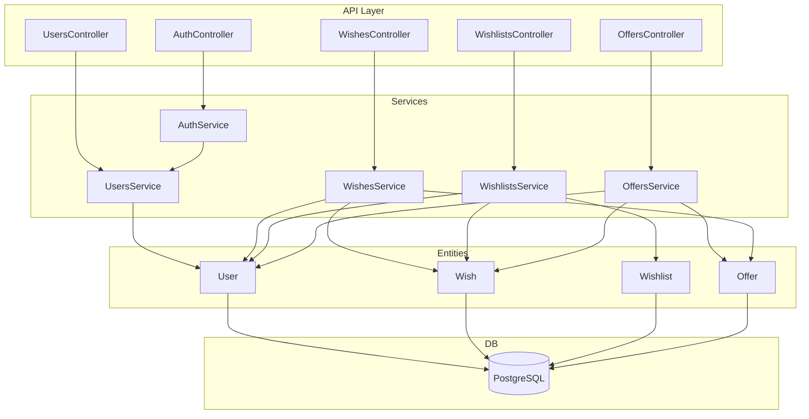

# Architecture Overview

This document provides a high-level, expert-level overview of the WishListShare wishlist service backend architecture. It integrates conceptual, structural, and implementation details, including module structure, database configuration, authentication, global patterns, and architectural decisions.

---

## System Architecture Diagram

---

## Modular Structure & Inventory

- **UsersModule**: User management, profile, search
  - users.module.ts, users.service.ts, users.controller.ts, entities/, dto/
- **WishesModule**: Gift CRUD, copy, progress
  - wishes.module.ts, wishes.service.ts, wishes.controller.ts, entities/, dto/, guards/
- **WishlistsModule**: Thematic collections of wishes
  - wishlists.module.ts, wishlists.service.ts, wishlists.controller.ts, entities/, dto/
- **OffersModule**: Contributions to gifts
  - offers.module.ts, offers.service.ts, offers.controller.ts, entities/, dto/, services/
- **AuthModule**: Registration, login, JWT/local strategies
  - auth.module.ts, auth.service.ts, auth.controller.ts, guards/, strategies/
- **Config**: configuration.ts

---

## Database Configuration
- **Type:** PostgreSQL
- **Connection:** Localhost, port 5432, user `student`, password `student`, database/schema `nest_project`
- **Entities:** User, Wish, Wishlist, Offer
- **Sync:** Enabled for development (auto-creates/updates schema based on entities)

---

## Authentication & Authorization
- **JWT AuthGuard:** Protects most endpoints, extends NestJS AuthGuard('jwt')
- **Local AuthGuard:** Used for login, extends AuthGuard('local')
- **Ownership Guards:** Enforce business rules for editing/deleting resources
- **JWT/Local Strategies:** Passport strategies for token and credential validation

---

## Global Patterns & Best Practices
- **DTO Validation:** All input validated with class-validator
- **RESTful Routing:** Resource-oriented, clear module separation
- **Separation of Concerns:** Services, controllers, entities, repositories
- **Configuration:** Sensitive values (e.g., JWT secret) loaded from config module
- **Auto Schema Sync:** Database schema kept in sync with entities during development
- **Centralized Error Handling:** Use global exception filters for consistent error responses

---

## Core Files & Entry Points
- main.ts
- app.module.ts
- app.controller.ts

---

> For more details, see the individual module, service, and domain model documentation. This architecture overview is kept up to date as the system evolves. 