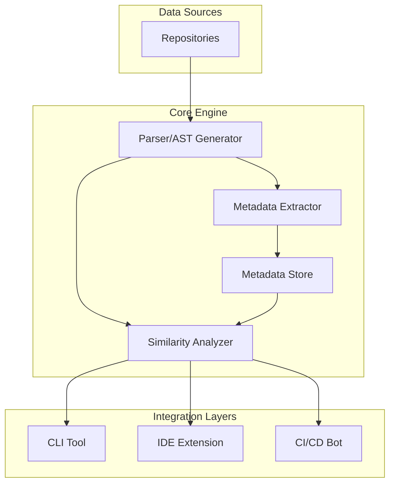

# Specification: Code Reuse Suggestion Tool

This document provides a detailed technical specification for the Code Reuse Suggestion Tool, based on the initial [Intent Document](./intent-gemini-2-5.md).

## 1. Introduction & Vision

The project's goal is to develop an intelligent tool that actively reduces code duplication across a large and fragmented ecosystem of React-based repositories. This includes micro-frontends, shared libraries, and git submodules. By proactively identifying and suggesting opportunities for code reuse, the tool aims to foster a more maintainable, consistent, and efficient codebase.

## 2. System Architecture

The system will be composed of several key components that work together to analyze code, manage metadata, and provide suggestions to developers.



- **Parser/AST Generator:** Responsible for parsing TypeScript/JavaScript code into Abstract Syntax Trees (ASTs). It will use a library like `@babel/parser` or `typescript`.
- **Metadata Extractor:** Traverses the AST to identify and extract structured information about code artifacts.
- **Metadata Store:** A persistent, queryable database for storing artifact metadata. This could be a file-based solution (like a collection of JSON files) for simplicity in local environments, or a more robust database for larger-scale deployments.
- **Similarity Analyzer:** The core logic for comparing new/modified code against the metadata store to find potential duplicates.
- **Integration Layers:** The user-facing components (CLI, IDE, CI/CD) that consume the analyzer's output and present suggestions.

## 3. Metadata Management

### 3.1. Metadata Store Schema

The metadata for each code artifact will be stored in a structured format. A central index file will map artifact names to their metadata files.

**Artifact Metadata Schema (`Artifact`):**

```json
{
  "symbolName": "string",
  "kind": "Component" | "Hook" | "Function" | "Type" | "Interface",
  "signature": {
    "parameters": [
      {
        "name": "string",
        "type": "string"
      }
    ],
    "returnType": "string",
    "generics": "string | null"
  },
  "documentation": "string | null",
  "source": {
    "filePath": "string",
    "commitHash": "string"
  },
  "codeSnippet": "string",
  "usage": {
    "importCount": "number",
    "importedBy": ["string"]
  }
}
```

### 3.2. Information to Capture

- **`symbolName`**: The exported name of the function, component, or type.
- **`kind`**: The type of artifact.
- **`signature`**:
    - **`parameters`**: An array of objects, each representing a parameter with its name and TypeScript type.
    - **`returnType`**: The TypeScript return type.
    - **`generics`**: A string representing any generic type parameters.
- **`documentation`**: The full JSDoc/TSDoc comment block associated with the artifact.
- **`source`**:
    - **`filePath`**: The relative path to the file containing the artifact.
    - **`commitHash`**: The git commit hash of the file at the time of the last update.
- **`codeSnippet`**: For React components, this will be the JSX structure. For functions and hooks, it will be a normalized version of the function body (e.g., with variable names standardized).
- **`usage`**:
    - **`importCount`**: The total number of files that import this artifact.
    - **`importedBy`**: A list of relative file paths that import this artifact.

## 4. Code Analysis & Similarity Detection

### 4.1. Analysis Triggers

- **IDE:** On file save, or after a configurable delay following a code change.
- **CLI:** Manually invoked by the user.
- **CI/CD:** Triggered by a push to a pull request branch.

### 4.2. Similarity Checks

The analysis will be performed in a pipeline, starting with the cheapest checks first.

1.  **Exact Name Match:** A direct lookup in the metadata store using the symbol name of the code being analyzed. This is the highest-confidence match.
2.  **Structural Similarity (AST Comparison):**
    - The analyzer will compare the AST of the new code with the ASTs of existing artifacts.
    - The comparison will focus on the structure of the code, ignoring variable names, comments, and whitespace.
    - A similarity score will be calculated based on the number of matching nodes and edges in the ASTs.
3.  **Semantic Similarity (Conceptual Matching):**
    - This is an advanced, optional feature that can be enabled.
    - It involves generating vector embeddings from code snippets and documentation using a pre-trained language model.
    - The system will then find the nearest neighbors in the vector space to identify conceptually similar artifacts. This can find duplicates even if the implementation is different.

### 4.3. Configurable Threshold

A `similarityThreshold` (a value between 0 and 1) will be defined in the configuration. A suggestion is only triggered if the calculated similarity score exceeds this threshold.

## 5. Suggestion Generation

### 5.1. Suggestion Content Schema

When a match is found, a `Suggestion` object is created:

```json
{
  "newCodeLocation": {
    "filePath": "string",
    "startLine": "number",
    "endLine": "number"
  },
  "recommendedArtifact": {
    "symbolName": "string",
    "source": {
      "filePath": "string"
    },
    "signature": "object" // (from Artifact schema)
  },
  "similarity": {
    "score": "number",
    "reason": "Exact Match | Structural | Semantic"
  },
  "migrationGuide": "string"
}
```

- **`migrationGuide`**: A short, auto-generated markdown snippet explaining how to import and use the recommended artifact.

## 6. Operating Modes & User Interfaces

### 6.1. CLI Tool

The CLI will be the primary interface for manual scans and scripting.

- **Commands:**
    - `reuse-suggest scan [files...]`: Scans specified files or directories.
        - `--config <path>`: Specify a config file.
        - `--ci`: Output in a format suitable for CI/CD environments (e.g., JSON).
    - `reuse-suggest init`: Creates a default `reuse-suggest.config.json` file.
    - `reuse-suggest seed`: Performs an initial scan of all repositories defined in the config to build the metadata store.

### 6.2. IDE Extension (VS Code)

- **Features:**
    - Real-time analysis of the active file.
    - Suggestions appear as diagnostics (warnings) with a "quick fix" option.
    - The quick fix will provide an action to automatically replace the duplicated code with an import and usage of the suggested artifact.
    - A custom panel to view all suggestions for the current workspace.

### 6.3. CI/CD Integration (GitHub Action)

- **Workflow:**
    1.  The action runs on `pull_request` events.
    2.  It checks out the code and runs the `reuse-suggest scan --ci` command on the changed files.
    3.  If suggestions are found, it posts a single, consolidated comment to the PR summarizing the findings.
    4.  The comment will include the suggestion details and a link to the relevant code lines.
    5.  The action will have a configurable option to fail the check if high-confidence duplicates are found.

## 7. Key Workflows

### 7.1. Initial Seeding

The `seed` command will:
1.  Read the list of target repositories from the configuration.
2.  For each repository, clone it locally to a temporary directory.
3.  Iterate through all relevant files (`.ts`, `.tsx`, `.js`, `.jsx`).
4.  Run the parser and metadata extractor on each file.
5.  Populate the metadata store with the extracted artifacts.

### 7.2. Continuous Synchronization

- On every merge to a main branch (configured via webhook), a process will:
    1.  Fetch the latest changes.
    2.  Analyze the commit to get a list of changed files.
    3.  Re-run the extraction process for each changed file.
    4.  Update existing metadata records or create new ones. If an artifact is deleted, its record will be marked as deprecated or removed.

### 7.3. Developer Feedback Loop

- In the IDE, developers can dismiss a suggestion. This feedback will be stored locally to prevent the same suggestion from appearing again for that specific code block.
- In the CI/CD comment, reactions (e.g., 👍/👎) can be used as a simple feedback mechanism to tune the suggestion algorithm over time.

## 8. Configuration

The `reuse-suggest.config.json` file will define the tool's behavior.

**Configuration Schema:**

```json
{
  "similarityThreshold": 0.85,
  "suggestionCount": 5,
  "ignorePatterns": [
    "node_modules/**",
    "dist/**",
    "**/*.test.ts"
  ],
  "repositories": [
    "/path/to/repo1",
    "/path/to/repo2"
  ],
  "modes": {
    "cli": true,
    "ide": true,
    "ci": {
      "enabled": true,
      "failOnHighConfidence": false
    }
  },
  "privacy": {
    "allowRemote": false,
    "remoteEndpoint": null
  }
}
```

## 9. Security & Privacy

- All analysis is local by default.
- If `allowRemote` is `true`, code snippets and ASTs (but not the full source file) may be sent to the `remoteEndpoint` for more advanced semantic analysis. This requires explicit user consent.

## 10. Success Criteria

- **Accuracy:** False-positive suggestion rate < 5%.
- **Performance:**
    - IDE suggestion latency < 150ms.
    - CI/CD check completion < 60 seconds.
    - Metadata updates for a 5,000-file repository < 2 minutes. 