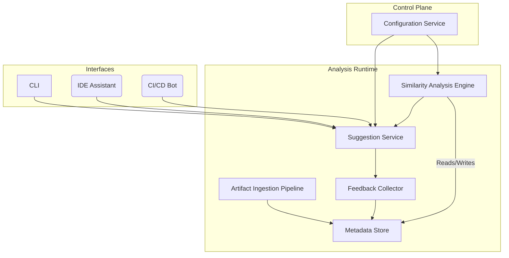

# Code Reuse Suggestion Tool – Functional & Technical Specification

## 1. Purpose & Scope
The **Code Reuse Suggestion Tool** continuously analyzes React repositories to detect opportunities for code reuse and surfaces actionable suggestions to developers.  It operates across three user-facing modes (CLI, IDE assistant, CI/CD bot) while safeguarding source-code privacy and collecting feedback to improve suggestion quality over time.

This document elaborates **how** each high-level intent requirement is fulfilled, covering architecture, data models, algorithms, interfaces, configuration, security, and operations.  It is the single source of truth for engineers building and maintaining the system.

## 2. Core Requirements Mapping
| # | Intent Statement | Spec Coverage |
|---|------------------|---------------|
| 1 | Maintain an up-to-date, centralized metadata store indexing every reusable artifact | Sections 4.1, 5 |
| 2 | Detect functional similarity between new/modified code and existing artifacts | Sections 4.2, 6 |
| 3 | Present reuse suggestions with links/references when similarity ≥ threshold | Sections 4.3, 7 |
| 4 | Support CLI, IDE assistant, and CI/CD bot modes | Section 7 |
| 5 | Synchronize metadata store on every merge (add/deprecate) | Section 4.1.3 |
| 6 | Track developer feedback to refine future recommendations | Sections 4.4, 8 |
| 7 | Provide configurable thresholds, ignore paths, privacy controls | Section 9 |
| 8 | Keep analysis within approved infra & comply with security standards | Section 10 |
| 9 | Supply comprehensive documentation (this spec, diagrams, setup guides) | Section 12 |

## 3. High-Level Architecture


### 3.1 Component Overview
1. **Artifact Ingestion Pipeline** – Extracts reusable artifacts from repositories, generates fingerprints, and upserts records into the metadata store.
2. **Metadata Store** – Central database holding artifact descriptors, fingerprints, similarity clusters, and feedback.
3. **Similarity Analysis Engine** – Computes embeddings and similarity scores; maintains cluster indexes.
4. **Suggestion Service** – Generates ranked suggestions when candidate code is analyzed.
5. **Feedback Collector** – Captures accept/reject signals and routes them back to the analysis engine for model refinement.
6. **Interfaces** – CLI, IDE assistant, CI/CD bot consume the Suggestion Service API.
7. **Configuration Service** – Stores organization/project-level settings (thresholds, ignore paths, privacy rules).

## 4. Component Design
### 4.1 Artifact Ingestion Pipeline
* **Trigger:** Repository merge event (main branch) or manual refresh.
* **Steps:**
  1. **Checkout & Scanning** – Clone repo at merge commit; traverse file system applying ignore rules.
  2. **Artifact Extraction** – Parse React/TypeScript source, identify *exported* components, hooks, utilities, and types.
  3. **Fingerprint Generation** – Produce AST-based hash and language-model embedding.
  4. **Upsert** – Insert new artifact or update existing record; mark removed artifacts as *deprecated*.
* **Idempotency:** Pipeline is repeatable; fingerprints include artifact path + content hash to avoid duplicates.

### 4.2 Similarity Analysis Engine
* **Embedding Model:** OpenAI `text-embedding-3-small` (pluggable).
* **Index:** Approximate Nearest Neighbor (ANN) index (FAISS IVF_FLAT).
* **Workflow:**
  1. Receive candidate code snippet + context (file path, repo).
  2. Generate embedding; query ANN for top-k similar artifacts.
  3. Compute structural similarity (AST diff ratio) and semantic similarity (embedding cosine).
  4. Combine scores via weighted formula yielding overall similarity.

### 4.3 Suggestion Service
* **API** `POST /suggestions` → returns ranked list with similarity score, artifact metadata, and code links.
* **Thresholding:** Results filtered by configurable `minSimilarity`.
* **Presentation Hints:** Each suggestion includes recommended reuse pattern (import existing artifact vs. refactor to shared package).

### 4.4 Feedback Collector
* Accepts `PATCH /feedback` with fields `{suggestionId, action: accepted|rejected, rationale?}`.
* Writes record to store; triggers periodic offline model retraining adjusting weighting parameters.

## 5. Data Model (relational-ish pseudo-DDL)
```sql
-- artifacts table
CREATE TABLE artifacts (
  id UUID PRIMARY KEY,
  repo TEXT,
  path TEXT,
  name TEXT,
  type ENUM('component','hook','util','type'),
  ast_hash CHAR(64),
  embedding VECTOR(384),
  first_seen TIMESTAMP,
  last_seen TIMESTAMP,
  deprecated BOOLEAN DEFAULT FALSE
);

-- suggestions table
CREATE TABLE suggestions (
  id UUID PRIMARY KEY,
  candidate_hash CHAR(64),
  artifact_id UUID REFERENCES artifacts(id),
  similarity FLOAT,
  generated_at TIMESTAMP
);

-- feedback table
CREATE TABLE feedback (
  id UUID PRIMARY KEY,
  suggestion_id UUID REFERENCES suggestions(id),
  action ENUM('accepted','rejected'),
  rationale TEXT,
  recorded_at TIMESTAMP
);

-- config table (scoped by org/project)
CREATE TABLE configs (
  id UUID PRIMARY KEY,
  scope TEXT, -- e.g., org/project
  key TEXT,
  value JSONB,
  updated_at TIMESTAMP
);
```

## 6. Algorithms & Scoring
```
final_similarity = w_semantic * cosine(embedding_a, embedding_b)
                 + w_struct   * (1 - ASTDiff(a,b))
```
Default weights `w_semantic = 0.7`, `w_struct = 0.3`; configurable per project.

Retraining pipeline periodically оптимизes weights using feedback labels (e.g., Bayesian optimization).

## 7. Interfaces
### 7.1 CLI
```
$ reuse-suggester scan ./src --since HEAD~1
$ reuse-suggester config set minSimilarity 0.82
```

### 7.2 IDE Assistant
* Extension surfaces inline code lens: “Reuse ‑ 3 similar artifacts found”.
* Clicking shows sidebar list with import/refactor quick-fix buttons.

### 7.3 CI/CD Bot
* GitHub Check annotates pull-request diff with suggestions.
* Failing threshold (e.g., must address suggestions ≥ 0.95) optional.

## 8. Feedback Loop & Learning
1. Collect accept/reject events.
2. Aggregate daily; produce labeled pairs `(similarityFeatures, label)`.
3. Update logistic regression calibrator to adjust weightings.
4. Deploy updated weights via Configuration Service.

## 9. Configuration & Privacy Controls
| Key | Type | Description |
|-----|------|-------------|
| `minSimilarity` | float | Minimum score to surface suggestion |
| `ignorePaths` | glob[] | Paths ignored during scanning |
| `privacy.disableSourceUpload` | bool | If true, embeddings generated on-prem; plaintext never leaves infra |
| `telemetry.enabled` | bool | Toggle feedback collection |

Config precedence: CLI flag → User IDE settings → Project config → Org default.

## 10. Security & Compliance
* **Data Residency:** Embeddings stored in region-scoped clusters.
* **Access Control:** Role-based; suggestion API requires OAuth token.
* **Audit Logging:** All API calls logged to SIEM.
* **Source-code Handling:** Raw code never transmitted externally if `disableSourceUpload=true`.

## 11. Deployment & Operations
| Aspect | Detail |
|--------|--------|
| Runtime | Node.js 20, TypeScript |
| Container | `ghcr.io/org/reuse-suggester:<tag>` |
| Orchestration | Kubernetes (HPA on CPU usage) |
| DB | PostgreSQL + pgvector extension |
| Index | FAISS sidecar; warm start from S3 snapshots |
| Monitoring | Prometheus + Grafana dashboards (latency, recall, feedback rate) |
| Alerts | PagerDuty on P99 latency > 2s or ingestion lag > 10m |

## 12. Documentation Deliverables
1. **Setup Guide** – Installing CLI & IDE extensions.
2. **Admin Guide** – Deploying backend, configuring secrets, scaling nodes.
3. **Developer Guide** – Extending artifact extractor, adding new language support.
4. **Architecture Diagram** – (see Section 3).
5. **API Reference** – OpenAPI spec generated from code.

## 13. Future Work
* Support additional languages (Vue, Svelte).
* GraphQL API for advanced queries.
* In-IDE autofix applying refactors automatically.
* Advanced similarity via CodeBERT embeddings.

---
© 2025 AwesomeOrg. Licensed under Apache-2.0. 