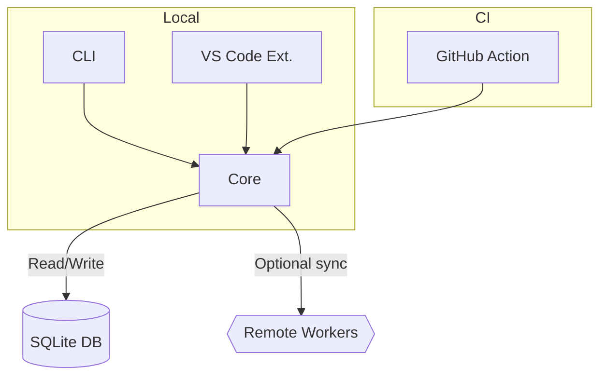

# Reuse-Suggest Tool Specification (v0.1)

> **Status**: Draft for cross-disciplinary review  
> **Derived From**: `docs/o3-pro-intent-augmented-ru.md` (approved intent)  
> **Last Updated**: 2025-07-23

---

## 1. Purpose & Success Criteria

**Outcome Statement**: Build an intelligent assistant that proactively eliminates code duplication across our React ecosystem by detecting reuse opportunities and delivering actionable suggestions to developers via CLI, VS Code, and CI pipelines.

| KPI | Target (MVP) | Target (GA) |
|-----|--------------|-------------|
| False-positive suggestion rate | ≤ 5 % | ≤ 3 % |
| False-negative (missed duplicate) rate | ≤ 10 % | ≤ 5 % |
| IDE suggestion latency | ≤ 150 ms | ≤ 100 ms |
| PR analysis time (≤ 2 k LOC diff) | ≤ 60 s | ≤ 30 s |
| Full metadata refresh (≤ 5 k files) | ≤ 2 min | ≤ 1 min |
| Suggestion acceptance rate | ≥ 50 % | ≥ 70 % |
| CLI reliability (no crashes) | ≥ 99 % | ≥ 99.5 % |

---

## 2. Functional Requirements

1. **Artifact Coverage**  
   – React components, hooks, utilities/helpers, TypeScript types/interfaces.
2. **Operating Modes**  
   – CLI (`reuse-suggest`) commands for scan, update-metadata, and report.  
   – VS Code extension with inline hints, quick actions, and a suggestion panel.  
   – GitHub Action for PR comment suggestions.
3. **Similarity Detection**  
   – Initial algorithms: Jaccard on identifier sets and Levenshtein on source text.  
   – Threshold configurable via config file / CLI flag.
4. **Metadata Store**  
   – SQLite file tracking artifact fingerprints; auto-sync on merges to `main`.
5. **Config Management**  
   – `reuse-suggest.config.{json,ts}` with thresholds, ignore paths, target repos, and `allowRemote` flag.
6. **Outputs**  
   – Human-readable suggestion lists (CLI, IDE) and JSON/Markdown reports.  
   – Exit codes for CI gating.
7. **Extensibility**  
   – Plugin interface for custom similarity metrics.
8. **Internationalization**  
   – English UI copy; internal strings ready for i18n.
9. **Out-of-Scope (v1)**  
   – Automatic refactoring of source code.  
   – Non-TypeScript projects.  
   – ML-based ranking feedback loops.

---

## 3. Non-Functional Requirements

| Category | Constraint |
|----------|------------|
| Performance | Meet KPI table above on dev laptops (4 vCPU / 8 GB RAM). |
| Compatibility | Node ≥ 20, npm ≥ 9; VS Code ≥ 1.85; OS: Win 10+, macOS 11+, Ubuntu 20.04+. |
| Privacy | Source code remains local unless `allowRemote=true`. |
| Licensing | Tool and deps must be MIT-compatible. |
| Reliability | ≥ 99 % successful CLI runs; graceful error messages. |
| Accessibility | VS Code UI meets WCAG 2.1 AA where applicable. |

---

## 4. System & Data Architecture

**Components**
- **Core Engine** – AST parsing (`ts-morph`), similarity calc, suggestion ranking.
- **SQLite Store** – Fingerprint table (artifact_id, hash, vector, path, metadata).
- **CLI Wrapper** – Exposes `scan`, `update-metadata`, `report` commands.
- **VS Code Extension** – Live AST diff, inline hints, panel UI.
- **GitHub Action** – Runs `scan` on PR diff, posts comments.

**Data Contracts**
- `ArtifactFingerprint` JSON schema shared between components.  
- Suggestion report schema (versioned) for IDE/CI rendering.

---

## 5. Safety / Governance Rules

1. **Security** – No code execution of scanned files; parse only.  
2. **Privacy** – Hashes/fingerprints only transmitted when `allowRemote=true`.  
3. **Licensing** – Warn if reused component is under incompatible license.  
4. **Ethical Boundaries** – Suggestions must not expose proprietary code from other repos without access rights.

---

## 6. Verification Plan

| Test Type | Description | Pass Criteria |
|-----------|-------------|---------------|
| Unit | AST parser correctly extracts component names, props | ≥ 95 % fixture coverage |
| Unit | Similarity calc returns ≥ 0.7 for known duplicates | True for all test pairs |
| Integration | CLI `scan` produces JSON matching schema | Schema validation passes |
| Integration | VS Code inline suggestion latency | `<150 ms` average across 20 runs |
| Integration | GitHub Action completes on 2 k LOC diff | `<60 s` runtime |
| E2E | Acceptance suite on sample monorepo | All KPIs met |
| Eval Prompt | LLM explanation of suggestion relevance | ≥ 4/5 helpfulness rating |

Automated tests run in CI; failures block merge.

---

## 7. Risks & Mitigations

| Risk | Probability | Impact | Mitigation |
|------|-------------|--------|-----------|
| High suggestion noise frustrates devs | Medium | High | Tunable threshold, staged rollout, feedback capture |
| AST parser fails on edge TS syntax | Medium | Medium | Use `ts-morph`, fallback text diff, regression corpus |
| Similarity search scalability | Low | High | Start in-memory, plan migration to `pgvector` |
| VS Code perf regressions | Medium | Medium | Benchmarks, lazy-load heavy modules |

---

*End of Specification – submit PR for cross-disciplinary review and sign-off (Eng, PM, Security, QA).* 